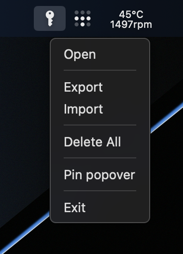
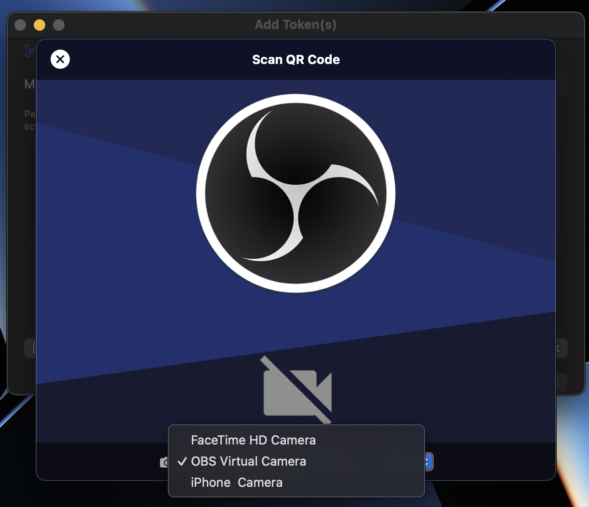
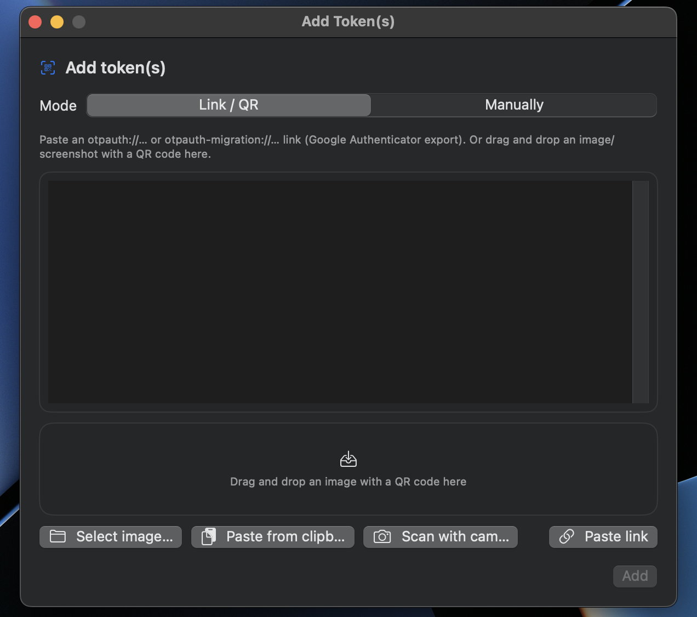
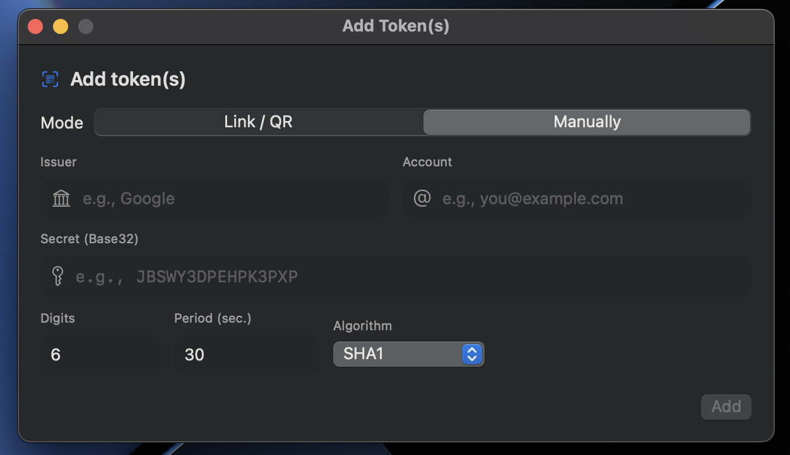

# GlassOTP

GlassOTP is a lightweight **TOTP authenticator for macOS** that lives in your menu bar.
Get your one-time codes instantly — no full application window, no clutter, fully offline.


## Features

* Menu bar TOTP authenticator — no Dock icon, always one click away
* Standard `otpauth://totp/…` links
* Google Authenticator export (`otpauth-migration://…`) — import many tokens at once
* QR code import from an image (file, drag & drop, or clipboard) or live camera
* Manual entry (issuer, account, Base32 secret, digits, period, algorithm)
* SHA1 / SHA256 / SHA512, 6- or 8-digit codes, custom period
* Secrets stored in the **macOS Keychain** — never in plain text on disk
* Optional **Touch ID / password lock** before codes are shown
* Encrypted, password-protected backup & restore
* QR export to move a token to another authenticator
* Rename, pin, search, and sort tokens
* One-click copy with a real-time countdown ring and optional auto-close

## Security

* All token secrets are stored in the **macOS Keychain**, never as plain text on disk.
* GlassOTP makes **no network connections** — it does not sync, transmit, or upload anything. All data stays on your device.
* Sensitive actions require system authentication (**Touch ID** or your macOS password):
  * Viewing or editing a secret key
  * Showing a token's QR code
* An optional **"Require Touch ID to view"** lock hides all codes until you authenticate.
* Authentication is cached briefly to avoid repeated prompts during a session.
* Backups are encrypted with **AES-GCM** using a key derived from your password (**PBKDF2-HMAC-SHA256**). Without the password, a backup file cannot be read.

> The backup file contains all your secrets. Choose a strong password — GlassOTP will warn you if it's too short.

## System Requirements

* macOS 11.7 or newer
* Apple Silicon or Intel Mac
* Camera access (optional, only for live QR scanning)

## Installation

1. Download the release archive.
2. Extract the ZIP file.
3. Move `GlassOTP.app` into your **Applications** folder.

## First Launch (Gatekeeper)

The app is not distributed with an Apple Developer certificate, so macOS Gatekeeper may block the first launch or show:

> "The application is damaged and can't be opened. You should move it to the Trash."

This is a quarantine flag added to files downloaded from the internet — not actual damage.

**Recommended (manual) fix** — run once in Terminal:

```sh
xattr -r -c /Applications/GlassOTP.app
```

Then open the app normally (or Control-click → **Open** the first time).

**Optional helper tools** (third-party, not bundled with GlassOTP):

* [Sentinel](https://github.com/alienator88/Sentinel) — removes the `com.apple.quarantine` attribute (macOS 13+).
* AutoFix — clears quarantine attributes and fixes permissions on older systems.

## Usage

GlassOTP runs from the macOS menu bar.

* **Left-click** the icon — open the token list.
* **Right-click** the icon — open the quick menu: **Open**, **Export**, **Import**, **Delete All**, **Pin popover**, **Exit**.



In the token list you can search, copy codes (just click a row), and add new tokens with the **+** button.



### Adding tokens

Press **+** in the top-right corner. You can add tokens in several ways:

* **QR code** — drag an image with a QR code onto the window, pick an image file, paste from the clipboard, or **scan with the camera**.
* **otpauth link** — paste an `otpauth://totp/…` URL.
* **Google Authenticator export** — paste an `otpauth-migration://…` link to import multiple tokens at once.
* **Manual entry** — fill in the fields by hand:



  * Issuer
  * Account
  * Secret (Base32)
  * Digits (6 or 8)
  * Period (seconds)
  * Algorithm (SHA1 / SHA256 / SHA512)



Duplicate tokens are detected automatically and skipped on import.

### Managing tokens

Right-click any token for quick actions:

* **Pin / Unpin** — keep important tokens at the top
* **Rename** — change the issuer or account label
* **Show QR code** — regenerate a QR to add the token to another authenticator *(requires authentication)*
* **Show / edit secret** — view or replace the Base32 secret *(requires authentication)*
* **Delete** — remove the token and its secret from the Keychain


### Backup & restore

From the **right-click menu**:

* **Export** — choose a location, set a password, and save an encrypted `.glassotp` backup of all tokens.
* **Import** — select a `.glassotp` file and enter its password. Existing tokens are skipped, new ones are added.

### Settings

Open the **settings menu** (slider icon) in the token list:

* **Close after copy** — automatically close the popover shortly after copying a code.
* **Require Touch ID to view** — lock the list until you authenticate.

## Notes & Limitations

* GlassOTP supports **TOTP only** (time-based codes). HOTP (counter-based) tokens are not generated.
* Code length is limited to **6 or 8 digits**.
* Status messages (export/import/delete) use macOS notifications. If notifications are disabled for GlassOTP, the app shows a small in-app notice, and import errors are shown as a dialog.

## Building from Source

Requirements:

* Xcode 14+
* Swift 5.7+

```sh
git clone https://github.com/Croakieee/GlassOTP.git
```

Open the project in Xcode and build normally.

## Contributing

Pull requests and improvements are welcome.
If you find a bug or have a feature request, please open an issue.

## Disclaimer

GlassOTP is an open source project provided without warranty. Use it at your own risk.
For maximum security, always keep recovery/backup codes for your accounts.

See [LICENSE](LICENSE) for license terms.

## ☕ Support the Project

If you like this project and want to support its development, you can buy me a coffee using **USDT (TRC20)**.

<div align="center">

<a href="https://tronscan.org/#/address/TKy58zzJkoTzab3XZXE5YpZVpH3oRoghjg">
  
</a>

</div>

<p align="center">

**USDT (TRC20) Wallet**

`TKy58zzJkoTzab3XZXE5YpZVpH3oRoghjg`

</p>

---

⭐ Any support helps keep the project improving and maintained.
