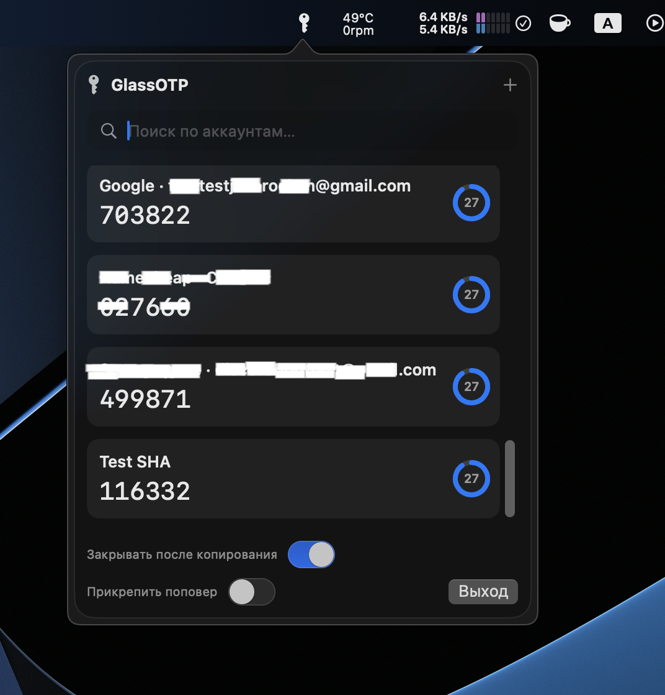

# GlassOTP

## Installation Guide

### First Launch

When launching the **GlassOTP** app for the first time, it may request permission multiple times to create and modify its folder in the macOS **Keychain**.

This is expected behavior on unsigned applications. In some cases the permissions may also be requested again after updates. Once permissions are granted, the application works normally and the stored keys will not be reset.

---

## Installation

1. Extract the downloaded **ZIP archive**.
2. Move **GlassOTP.app** to your **Applications** folder.
3. Launch the application by **holding the Control key**, clicking the app, and selecting **Open**.

---

## macOS Security Warning (AutoFix)

On newer versions of macOS you may see a security warning saying that the application is damaged and cannot be opened.

Example message:

> “The application is damaged and can’t be opened. You should move it to the Trash.”

This happens because **macOS Gatekeeper** blocks applications that are not signed by an identified developer.

To resolve this issue you can use the included **AutoFix** tool.

---

## Using AutoFix

1. Launch **AutoFix.app**.

If this is the first launch, macOS may display:

> “AutoFix can't be opened because the developer cannot be verified.”

### How to open it

1. Right‑click (or **Control + Click**) on **AutoFix.app**
2. Select **Open**
3. In the dialog window click **Open** again

After launching AutoFix:

1. Select **GlassOTP.app**
2. Run the fix

---

## What AutoFix Does

AutoFix runs several system commands with **sudo privileges** to remove macOS security flags and fix permissions:

```bash
xattr -c -r
xattr -r -d
chmod +x
chown -R $USER
chmod -R 777
```

These commands:

* Remove extended attributes added by macOS
* Fix application permissions
* Ensure the application can run properly

---

## After Fixing

Once the process is complete, **GlassOTP** should launch normally without macOS blocking it.

---

## Manual Fix (Alternative)

If you do not want to use AutoFix, you can run the following command manually:

```bash
sudo xattr -r -c /Applications/APP.app
```

Replace `APP.app` with the name of the application if it differs.
